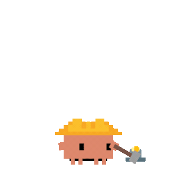
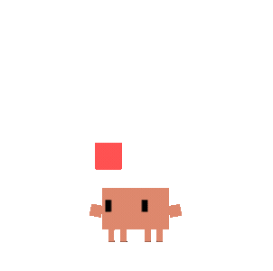

# Clawd Buddy

Clawd Buddy 是一个独立运行的 Electron 桌宠应用。主角 Clawd 是一只橙色像素风小章鱼，会待在你的桌面上，空闲时用眼睛跟随鼠标，长时间不动会睡觉，平时还会自己做出一些随机小动作，让它看起来像“活着”一样。

这个仓库当前已经从“AI coding agent 配套工具”改造成“独立桌宠版本”，**不再依赖 Claude Code / Codex / Cursor / Gemini 等外部 hook、plugin 或日志轮询**。

## 来源说明

本项目的当前版本基于原开源项目 `clawd-on-desk` 的代码与素材体系继续改造而来。

- 原项目仓库：<https://github.com/rullerzhou-afk/clawd-on-desk>
- 原项目作者：[@rullerzhou-afk](https://github.com/rullerzhou-afk)
- 原项目最初定位：面向 AI coding agent 的桌面宠物，通过外部 hook / plugin / 日志轮询驱动动画状态

当前仓库是在保留原有桌宠显示能力、主题系统、动画素材组织和大量交互基础设施的前提下，继续演进出的**独立桌宠版本**。如果后续继续发布或二次开发，建议始终保留对原项目与原作者的明确署名。

## 当前版本特性

- 独立桌宠，无需任何外部 agent 配置
- 透明、置顶、点击穿透的 Electron 双窗口桌宠
- idle 状态眼睛跟随鼠标
- 60 秒无鼠标移动后进入睡眠序列，鼠标移动后唤醒
- 白天每 2 到 5 分钟、深夜每 10 到 20 分钟随机触发自主行为
- 单击 happy，双击 poke，4 连击 flail
- 支持拖拽、Mini 模式、位置记忆、系统托盘
- 支持 `Clawd` / `Calico` 两套内置主题
- 支持 Settings 面板、自定义主题、动画覆盖和快捷键

## 快速开始

```bash
npm install
npm start
```

构建命令：

```bash
npm run build
npm run build:mac
npm run build:linux
npm run build:all
```

测试命令：

```bash
npm test
```

## 交互说明

- 单击：触发开心动画
- 双击：触发 poke 反应
- 快速 4 连击：触发 flail 反应
- 右键菜单：逗我玩 / Mini 模式 / Settings / Quit
- 托盘菜单：显示或隐藏 / 逗我玩 / Mini 模式 / 尺寸 / 勿扰模式 / 开机自启 / 退出
- 拖到屏幕边缘：进入 Mini 模式

## 自主行为规则

- 默认状态是 `idle`
- 60 秒无鼠标移动后，进入原有睡眠序列
- 睡眠期间不会触发随机自主行为
- 白天 / 工作时段：2 到 5 分钟随机触发一个行为
- 深夜 `23:00 - 06:00`：10 到 20 分钟随机触发一个行为
- 随机行为池复用现有状态：`attention`、`thinking`、`working`、`sweeping`、`carrying`
- 勿扰模式只暂停“自主随机行为”，不影响点击、拖拽、Mini 模式和睡眠唤醒

## 动画一览

<table>
  <tr>
    <td align="center"><br><sub>待机</sub></td>
    <td align="center"><br><sub>思考</sub></td>
    <td align="center"><br><sub>打字</sub></td>
    <td align="center"><br><sub>建造</sub></td>
    <td align="center"><br><sub>杂耍</sub></td>
    <td align="center"><br><sub>指挥</sub></td>
  </tr>
  <tr>
    <td align="center"><br><sub>报错</sub></td>
    <td align="center"><br><sub>开心</sub></td>
    <td align="center"><br><sub>通知</sub></td>
    <td align="center"><br><sub>扫地</sub></td>
    <td align="center"><br><sub>搬运</sub></td>
    <td align="center"><br><sub>睡觉</sub></td>
  </tr>
  <tr>
    <td align="center"><br><sub>三花待机</sub></td>
    <td align="center"><br><sub>三花思考</sub></td>
    <td align="center"><br><sub>三花打字</sub></td>
    <td align="center"><br><sub>三花建造</sub></td>
    <td align="center"><br><sub>三花杂耍</sub></td>
    <td align="center"><br><sub>三花指挥</sub></td>
  </tr>
</table>

完整事件映射表、极简模式、点击彩蛋见：**[docs/guides/state-mapping.zh-CN.md](docs/guides/state-mapping.zh-CN.md)**

## 项目结构

核心运行链路：

```text
AutonomousBehavior / 用户交互
  -> src/main.js
  -> src/state.js
  -> IPC
  -> src/renderer.js
```

关键文件：

- `src/main.js`
  - Electron 生命周期
  - 窗口创建
  - 托盘 / 菜单
  - 自主行为接线
- `src/autonomous-behavior.js`
  - 自主行为调度
  - 昼夜频率切换
  - transient 动画播放
- `src/state.js`
  - 状态机
  - sleep / wake
  - oneshot 自动回退
  - Mini 状态映射
- `src/tick.js`
  - 鼠标轮询
  - 眼睛跟随
  - idle 计时
  - Mini hover peek
- `src/renderer.js`
  - 动画文件切换
  - SVG / 图片显示层
  - 眼睛与 body transform
- `src/hit-renderer.js`
  - 单击 / 双击 / 连击判定
  - 拖拽生命周期
  - 右键菜单触发
- `src/menu.js`
  - 托盘菜单
  - 桌宠右键菜单

## 文档入口

- 安装与运行：[`docs/guides/setup-guide.md`](docs/guides/setup-guide.md)
- 当前运行时说明：[`docs/project/agent-runtime-architecture.md`](docs/project/agent-runtime-architecture.md)
- 本次独立化改造交接文档：[`docs/project/standalone-refactor-handoff.md`](docs/project/standalone-refactor-handoff.md)
- 主题系统与状态 UI 说明：[`docs/project/theme-state-ui.md`](docs/project/theme-state-ui.md)
- 主题制作指南：[`docs/guides/guide-theme-creation.md`](docs/guides/guide-theme-creation.md)

## 后续开发建议

如果后续继续迭代，建议优先看这两份文档：

1. `AGENTS.md`
2. `docs/project/standalone-refactor-handoff.md`

后者会详细说明：

- 原项目背景
- 本次改造做了什么
- 当前保留能力与删除内容
- 已验证内容
- 适合后续继续推进的方向

## License

源代码基于 [MIT 许可证](LICENSE) 开源。

**美术素材（assets/）不适用 MIT 许可。** 所有权利归各自版权持有人所有，详见 [assets/LICENSE](assets/LICENSE)。

- **Clawd** 角色设计归属 [Anthropic](https://www.anthropic.com)。本项目为非官方粉丝作品，与 Anthropic 无官方关联。
- **三花猫** 素材由 鹿鹿 ([@rullerzhou-afk](https://github.com/rullerzhou-afk)) 创作，保留所有权利。
- **第三方画师作品**：版权归各自作者所有。

如果你基于本仓库继续分发、再创作或公开发布衍生版本，请同时保留对原始项目 `clawd-on-desk` 及其作者 [@rullerzhou-afk](https://github.com/rullerzhou-afk) 的来源说明。
